# Liftd — Dokumentacja projektu

**Przedmiot:** Architektura i komunikacja między systemami i bazami danych  
**Temat:** Mobilny dziennik treningowy (workout tracker)  
**Repozytorium:** https://github.com/areksroczyk/workout-tracker

---

## 1. Opis projektu

Liftd to system składający się z:

- **aplikacji mobilnej iOS** (SwiftUI) — interfejs użytkownika,
- **serwera REST API** (FastAPI) — logika biznesowa i autoryzacja,
- **bazy danych SQL** — przechowywanie użytkowników, ćwiczeń, szablonów i historii treningów,
- **lokalnej bazy na urządzeniu** (SwiftData) — cache i tryb offline.

Użytkownik loguje się przez **Google OAuth**, aplikacja otrzymuje **JWT** i komunikuje się z backendem przez **HTTP/JSON**. Może tworzyć szablony treningów, prowadzić sesje (serie, ciężar, powtórzenia) i przeglądać historię.

---

## 2. Architektura systemu

```
┌─────────────────┐         HTTPS / JSON          ┌─────────────────┐
│   iOS (SwiftUI) │  ◄──────────────────────────► │  FastAPI Server │
│   SwiftData     │      Bearer JWT Token         │   SQLAlchemy    │
│   (lokalnie)    │                               │   SQLite/PG     │
└────────┬────────┘                               └────────┬────────┘
         │                                                  │
         │  Google Sign-In                                  │
         ▼                                                  ▼
┌─────────────────┐                               ┌─────────────────┐
│  Google OAuth   │                               │  Baza danych    │
│  (zewnętrzne)   │                               │  users, exercises│
└─────────────────┘                               │  templates,     │
                                                  │  sessions, sets │
                                                  └─────────────────┘
```

**Przepływ logowania:**

1. Użytkownik klika „Sign in with Google” w aplikacji iOS.
2. Google zwraca ID token.
3. Aplikacja wysyła token do `POST /api/v1/auth/google`.
4. Backend weryfikuje token i zwraca JWT.
5. JWT jest zapisywany w Keychain i dołączany do kolejnych żądań API.

---

## 3. Stack technologiczny

| Warstwa           | Technologia                       |
| ----------------- | --------------------------------- |
| Aplikacja mobilna | Swift, SwiftUI, SwiftData         |
| Backend           | Python, FastAPI, Uvicorn          |
| Baza serwerowa    | SQLite (development) / PostgreSQL |
| Baza lokalna      | SwiftData (SQLite na urządzeniu)  |
| Autentykacja      | Google OAuth 2.0 + JWT            |
| Komunikacja       | REST API, HTTP, JSON              |
| Kontrola wersji   | Git, GitHub                       |

Szczegółowy opis API i schemat bazy: [`PRD.md`](PRD.md)

---

## 4. Backend (REST API)

### 4.1 Endpointy

| Metoda              | Endpoint               | Opis                                           |
| ------------------- | ---------------------- | ---------------------------------------------- |
| POST                | `/api/v1/auth/google`  | Logowanie przez Google, zwrot JWT              |
| POST                | `/api/v1/auth/refresh` | Odświeżenie tokenu                             |
| GET                 | `/api/v1/exercises`    | Lista ćwiczeń (filtr: kategoria, wyszukiwanie) |
| GET/POST/PUT/DELETE | `/api/v1/templates`    | CRUD szablonów treningowych                    |
| GET/POST/DELETE     | `/api/v1/sessions`     | Historia i zapis sesji treningowych            |
| GET/PATCH/DELETE    | `/api/v1/users/me`     | Profil użytkownika                             |

Dokumentacja interaktywna (Swagger): http://localhost:8000/docs

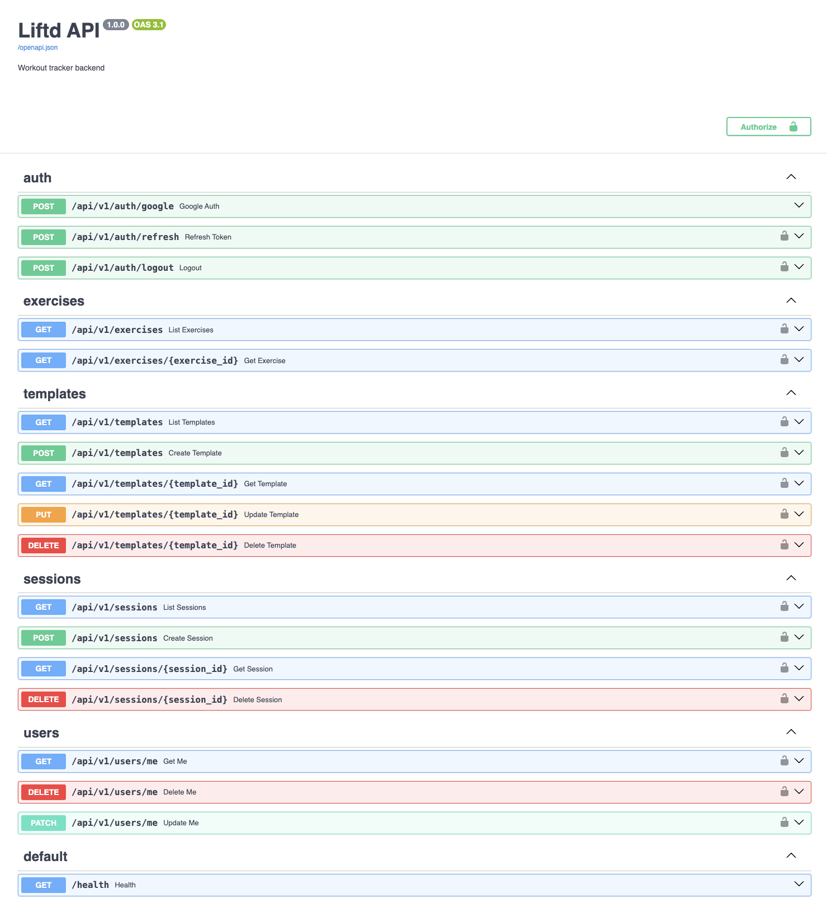

### 4.2 Baza danych (serwer)

Relacyjna baza SQL z tabelami powiązanymi kluczami obcymi:

| Tabela               | Opis                                        |
| -------------------- | ------------------------------------------- |
| `users`              | Konta użytkowników (Google ID, email)       |
| `exercises`          | Słownik ćwiczeń (seed przy starcie serwera) |
| `templates`          | Szablony treningów użytkownika              |
| `template_exercises` | Ćwiczenia w szablonie (N:M)                 |
| `sessions`           | Ukończone sesje treningowe                  |
| `session_exercises`  | Ćwiczenia w sesji                           |
| `sets`               | Serie (ciężar, powtórzenia, status)         |

Operacje **CRUD** realizowane m.in. na szablonach i sesjach. Ćwiczenia są danymi referencyjnymi (odczyt + wyszukiwanie po nazwie i kategorii).

### 4.3 Uwierzytelnianie i bezpieczeństwo

- Logowanie przez **Google OAuth 2.0** (zewnętrzne API).
- Backend wydaje **JWT** — ważny token sesji.
- Token przechowywany w **iOS Keychain** (nie w pliku ani UserDefaults).
- Endpointy chronione nagłówkiem `Authorization: Bearer <token>`.
- Obsługa błędów HTTP: 400, 401, 404, 422 itd.

### 4.4 Obsługa błędów

- Walidacja danych wejściowych (Pydantic).
- Zwracanie odpowiednich kodów HTTP.
- W aplikacji iOS: obsługa 401 (wylogowanie), błędów sieci, stanów pustych (empty state).

---

## 5. Aplikacja mobilna (iOS)

### 5.1 Ekrany aplikacji

Aplikacja posiada 4 zakładki: **Workout**, **History**, **Analytics** (placeholder), **Profile**.

#### Logowanie

Ekran startowy z logowaniem przez Google.

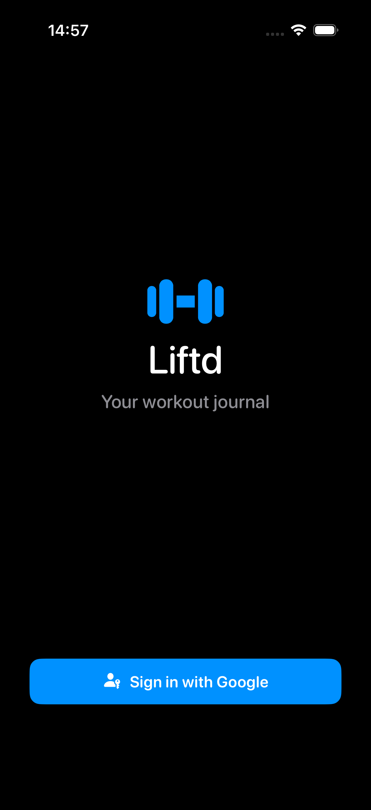

#### Ekran główny — szablony treningów

Lista szablonów użytkownika i przycisk „New Workout”.

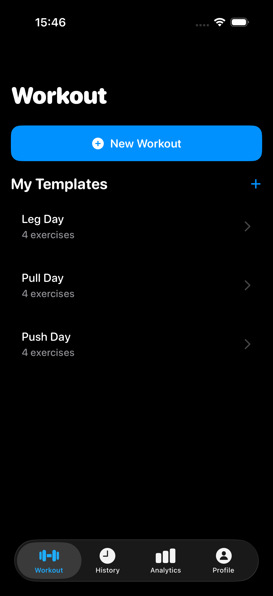

#### Szczegóły szablonu

Podgląd ćwiczeń w szablonie i przycisk „Start Workout”.

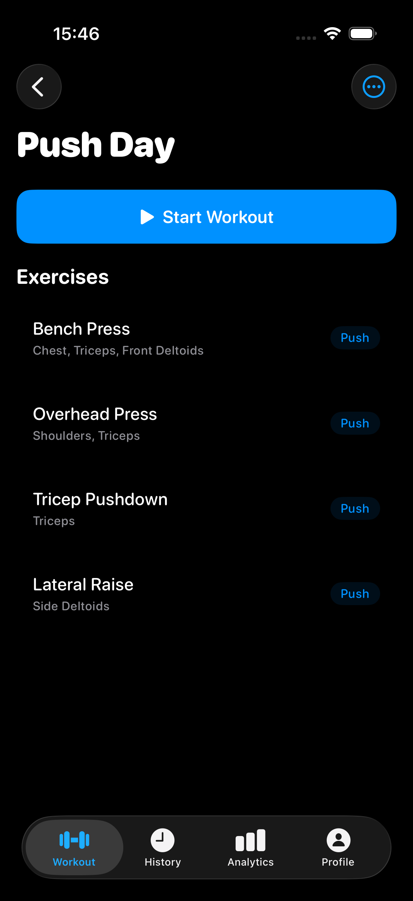

#### Aktywna sesja treningowa

Logowanie serii (kg, reps), timer, dodawanie ćwiczeń.

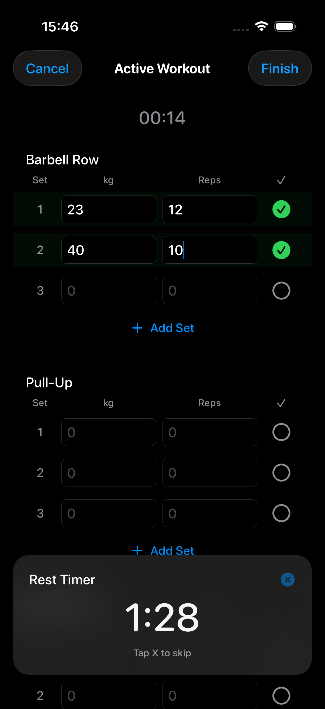

#### Wybór ćwiczenia

Wyszukiwarka i filtry kategorii (Push / Pull / Legs / Core / Cardio).

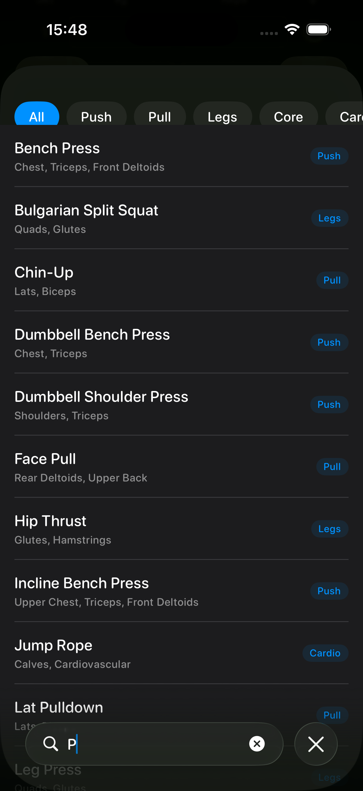

#### Podsumowanie treningu

Statystyki po zakończeniu sesji (czas, ćwiczenia, serie, objętość).

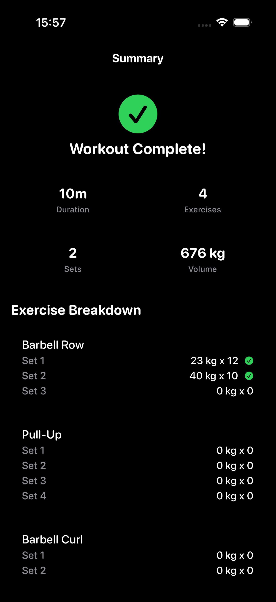

#### Historia treningów

Lista ukończonych sesji posortowana chronologicznie.

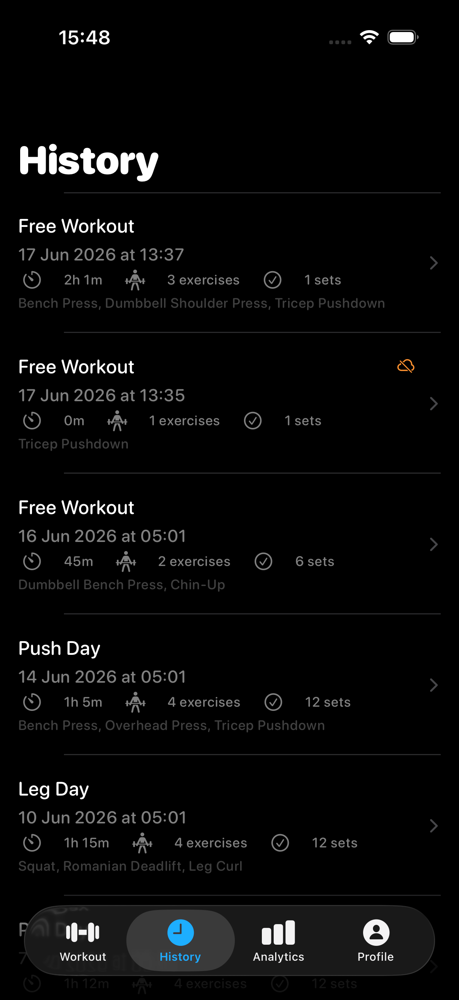

#### Szczegóły sesji z historii

Data, czas trwania, ćwiczenia z seriami i ciężarami.

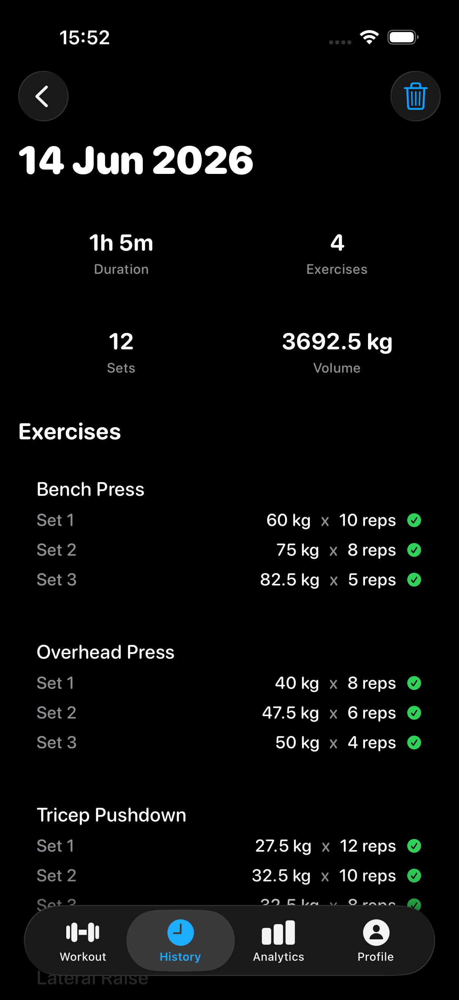

#### Analytics

Podstawowe statystyki (liczba treningów, objętość, średni czas) oraz sekcja „coming soon”.

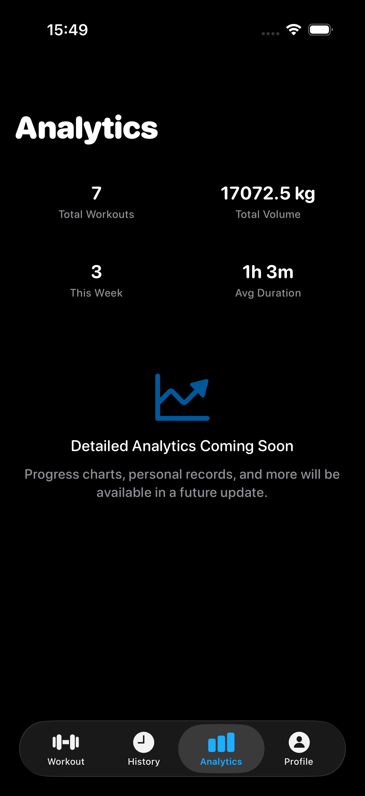

#### Profil użytkownika

Dane konta z Google i wylogowanie.

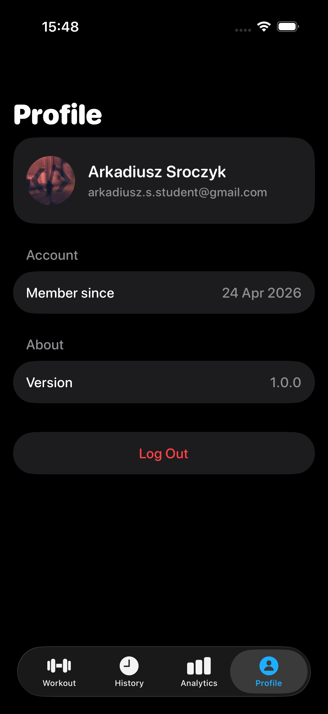

### 5.2 Lokalna baza danych (SwiftData)

Na urządzeniu przechowywane są m.in.:

| Model           | Zastosowanie                       |
| --------------- | ---------------------------------- |
| `ExerciseLocal` | Cache listy ćwiczeń                |
| `TemplateLocal` | Szablony (offline)                 |
| `SessionDraft`  | Sesje w trakcie i historia lokalna |
| `SyncQueueItem` | Kolejka operacji do synchronizacji |

### 5.3 Tryb offline

- Sesja treningowa zapisuje się lokalnie na bieżąco.
- Po zakończeniu — synchronizacja z serwerem.
- Brak internetu → operacja trafia do kolejki i jest wysyłana po powrocie sieci.

---

## 6. Mapowanie na wymagania projektowe

| Wymaganie               | Realizacja w projekcie                            |
| ----------------------- | ------------------------------------------------- |
| REST API                | FastAPI, endpointy `/api/v1/...`                  |
| Baza SQL                | SQLite / PostgreSQL, SQLAlchemy ORM               |
| CRUD                    | Szablony (pełny CRUD), sesje (create/read/delete) |
| Uwierzytelnianie        | Google OAuth + JWT                                |
| Obsługa błędów          | Kody HTTP, walidacja, stany błędów w iOS          |
| Aplikacja mobilna       | SwiftUI (iOS)                                     |
| Pobieranie danych z API | Repositories + URLSession                         |
| Lokalna baza            | SwiftData                                         |
| Wyszukiwanie            | Ćwiczenia: po nazwie i kategorii                  |
| Wiele tabel             | Sesje z ćwiczeniami i seriami (JOIN)              |
| API logowania (Google)  | Google Sign-In SDK + weryfikacja na backendzie    |
| REST HTTP               | GET, POST, PUT, DELETE                            |

---

## 7. Uruchomienie

Instrukcja uruchomienia backendu i aplikacji iOS: [`README.md`](README.md)

**Dane demonstracyjne** (szablony + historia treningów):

```bash
cd backend && source .venv/bin/activate
python -m app.seed_demo --email TWOJ@EMAIL
```

---

## 8. Zespół

| Osoba | Zakres                                 |
| ----- | -------------------------------------- |
|       | Aplikacja iOS (SwiftUI, SwiftData, UI) |
|       | Backend (FastAPI, baza danych, API)    |

---

## 9. Testy

Backend: 21 testów automatycznych (`pytest tests/ -v`) — endpointy ćwiczeń, szablonów, sesji i użytkownika.

---

_Dokumentacja projektu — Liftd_
